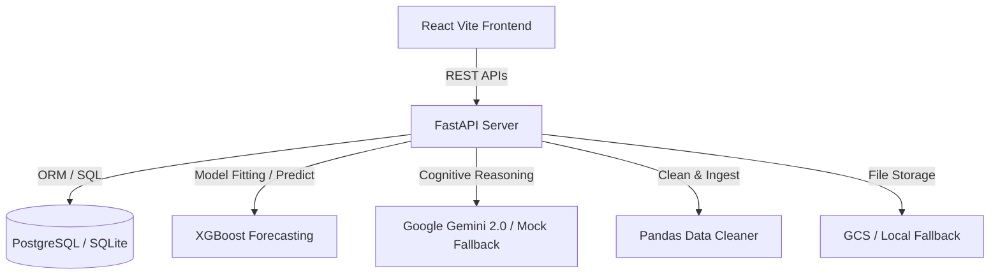

# StockSense AI – Retail Inventory Decision Intelligence Platform

StockSense AI is an AI-powered retail decision intelligence platform designed to help store managers make optimal restocking decisions, forecast future consumer demand, simulate inventory scenarios, and chat with local databases using Gemini.

## Key Features

1. **Manager KPI Dashboard**: Visualizes inventory values, sales performance, restocking priority alerts, category performance, and supplier reliability using responsive charts.
2. **Interactive Inventory Portal**: Full-table tracking with search, sorting, category filtering, warehouse filters, and instant low-stock flags.
3. **ML Demand Forecasting**: Custom XGBoost-based forecasting model that consumes daily historical sales, extracts seasonality lags, and trains a regression model to predict next week's inventory requirements.
4. **Decision Simulator**: Premium interactive side-by-side comparison playground. Managers adjust price tags, discounts, and restocking orders using sliders to simulate net margins, stockout likelihood, and ROI, with natural language descriptions generated by Gemini.
5. **AI Chat Assistant**: PostgreSQL-driven Retrieval-Augmented Generation (RAG) assistant utilizing the official `google-genai` SDK. Supports suggestions and offline fallback when keys are missing.
6. **Data Ingestion Portal**: Drag-and-drop CSV uploader that filters negative quantities, normalizes headers, handles duplicates, and cleans dates in a transaction batch.

---

## Technical Architecture



- **Frontend**: React 18, Vite, TypeScript, Tailwind CSS, Recharts, Lucide Icons.
- **Backend**: FastAPI, SQLAlchemy ORM, Uvicorn ASGI server.
- **Machine Learning**: XGBoost, Scikit-learn, Pandas, Numpy.
- **AI Integration**: Official Google GenAI SDK (`google-genai`).

---

## Installation & Setup

You can run StockSense AI either **locally on your host system** (zero database setup required, falls back to SQLite) or **containerized via Docker Compose** (full Postgres integration).

### Option 1: Run Locally on Host (SQLite Mode)

#### 1. Setup the Backend
1. Navigate to the backend folder:
   ```bash
   cd backend
   ```
2. Create and activate a virtual environment (optional but recommended):
   ```bash
   python -m venv venv
   source venv/bin/activate  # On Windows: venv\Scripts\activate
   ```
3. Install the dependencies:
   ```bash
   pip install fastapi uvicorn sqlalchemy pandas numpy scikit-learn xgboost google-genai "python-jose[cryptography]" "passlib[bcrypt]" python-multipart requests
   ```
4. Start the server on port 8000:
   ```bash
   python -m uvicorn app.main:app --host 127.0.0.1 --port 8000
   ```

#### 2. Seed Sample Data (Host Mode)
In another terminal, from the root directory, run the database seeder to register the default account, upload historical transactions, and train the XGBoost forecasting model:
```bash
python backend/data/seed_data.py
python backend/data/seed_db_via_api.py
```

#### 3. Setup the Frontend
1. Navigate to the frontend folder:
   ```bash
   cd frontend
   ```
2. Install npm packages:
   ```bash
   npm install
   ```
3. Start the Vite development server:
   ```bash
   npm run dev
   ```
4. Open your browser and navigate to `http://localhost:5173`.
5. Log in with the default credentials:
   - **Email**: `manager@retailstore.com`
   - **Password**: `password123`

---

### Option 2: Run via Docker Compose (PostgreSQL Mode)

Docker Compose automatically configures Postgres, runs the backend FastAPI server, and spins up Nginx to serve the React application on port 80 with reverse proxying for the `/api` route.

1. From the project root, start the containers:
   ```bash
   docker-compose up --build
   ```
2. Once the services start:
   - Open your browser and go to `http://localhost`.
   - The frontend automatically routes API calls to `http://localhost/api` which is proxied to the backend container.
3. Access the database locally on port `5432` if needed (user: `postgres`, password: `postgres`, DB: `stocksense`).

---

## Looker Studio Integration

StockSense AI exposes three database views optimized for Google Looker Studio:
1. `v_sales_trends`: Aggregates historical sales by category and SKU.
2. `v_inventory_health`: Categorizes stock levels into `LOW STOCK`, `HEALTHY`, and `OVERSTOCK`.
3. `v_demand_forecast`: Displays XGBoost future demand estimates.

For detailed steps, refer to [LOOKER_STUDIO_GUIDE.md](file:///C:/Users/hp/OneDrive/Attachments/Desktop/genai/LOOKER_STUDIO_GUIDE.md).

---

## Environment Variables

Create a `.env` file in the `backend/` directory to configure credentials:

```ini
# Database Connection (automatically set by compose)
DATABASE_URL=sqlite:///data/stocksense.db

# JWT Security
SECRET_KEY=super-secret-key-for-jwt-authentication-stocksense-ai-2026

# Gemini API Key (Optional: fallbacks to rule engine if empty)
GEMINI_API_KEY=your_gemini_api_key_here

# Google Cloud Storage (Optional: fallbacks to local directory storage)
GCP_BUCKET_NAME=your_gcp_bucket_name
GOOGLE_APPLICATION_CREDENTIALS=path_to_gcp_service_account_credentials.json
```
